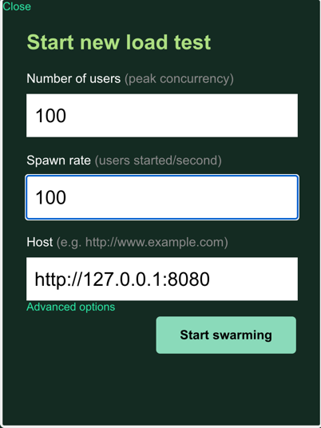
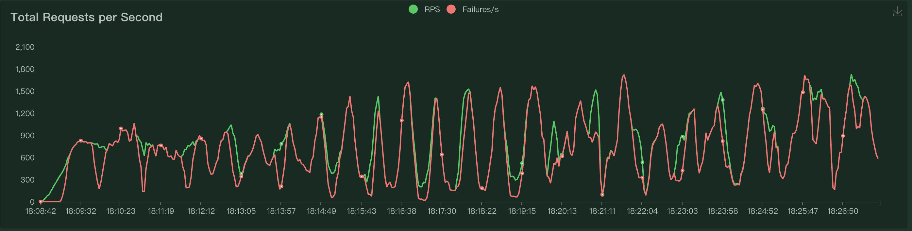

## run a Redis
    skip

## build image
    docker build -t ratelimit:01 .

## run four process
    docker run -idt -p 3000:3000 --link ${your_redis_host}:redis.orb.local  ratelimit:01
    docker run -idt -p 3001:3000 --link ${your_redis_host}:redis.orb.local  ratelimit:01
    docker run -idt -p 3002:3000 --link ${your_redis_host}:redis.orb.local  ratelimit:01
    docker run -idt -p 3003:3000 --link ${your_redis_host}:redis.orb.local  ratelimit:01
    docker run -idt -p 3004:3000 --link ${your_redis_host}:redis.orb.local  ratelimit:01

## install python3
    skip

## install locust package
    pip3 install locust

## modify nginx
confirm you nginx.conf path

```text
events {
    worker_connections  1024;
}


http {
    include       mime.types;
    default_type  application/octet-stream;

    #tcp_nopush     on;

    keepalive_timeout  65;

    upstream backend {
        server localhost:3000 weight=1;
        server localhost:3001 weight=1;
        server localhost:3002 weight=1;
        server localhost:3003 weight=1;
    }

    server {
        listen       8080;
        server_name  localhost;

        location / {
   		      proxy_pass http://backend;
	    }     
    }
}
```

## start nginx
nginx

## simple test
curl http://127.0.0.1:8080/test1
curl http://127.0.0.1:8080/test2

## bench test
    python3 -m locust -f benchMark.py

## open browser
    http://0.0.0.0:8089 

## configuration


## end pic


I can see a successful wave of requests every five minutes, while the rest of the requests are being blocked due to exceeding the rate limiter.
